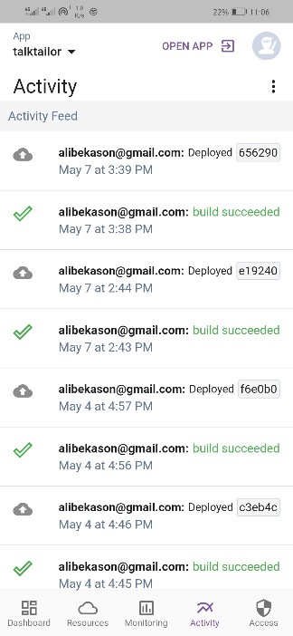

# Herome for Heroku

Herome for Heroku is an Open Source Heroku client mobile application built from scratch.

Herome is currently on active development.

### Features
* Authentication
   - [x] Basic Auth
   - [ ] Oauth2
   
* Account 
   - [x] Single Account
   - [ ] Multiple Account
   
* Search Apps

* View Addons

* View Builds and Deploys

* View, add remove collaborators

* Pending Features
    - [ ] Add Monitoring
    - [ ] Use Biometrics
    - [ ] Add Addons

### Screenshots

